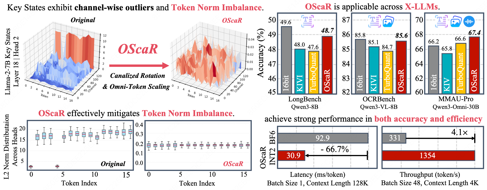
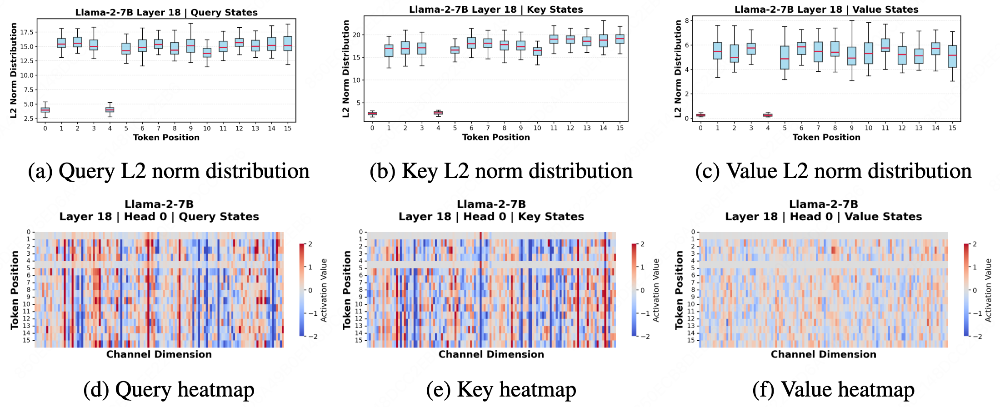
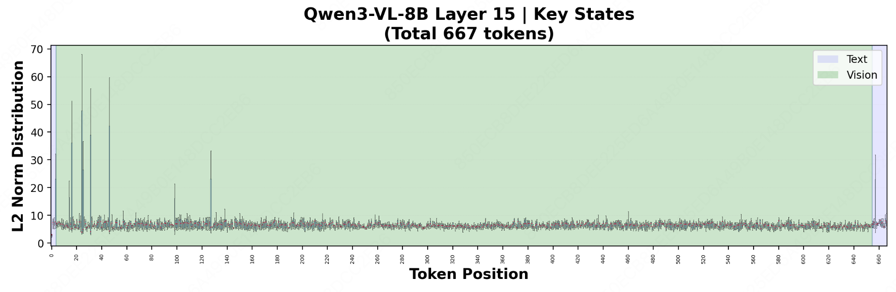
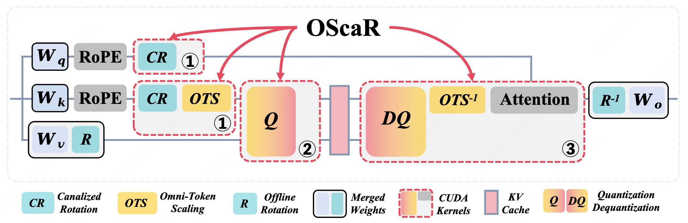

<h1 align="center">
  <br>
  OScaR: The Occam's Razor for Extreme KV Cache Quantization in LLMs and Beyond<br>
  <sub style="color: #FF6B6B; font-family: cursive;">
    ⚡ Data-free · Training & Calibration-free · Plug-and-Play for X-LLMs
  </sub>
</h1>

<div align="center">
  <a href="#"></a>
  <a href="#"></a>
  <a href="#"></a>
  <a href="#"></a>
  <a href="http://arxiv.org/abs/2605.19660"></a>
  <a href="./LICENSE"></a>
</div>

## 🔥 Latest News

- **[Upcoming]** 🔧 vLLM & SGLang backend integration — under active development, official support will be announced in future releases.

- **[2026-05-20]** 🎉 Our paper *"OScaR: The Occam's Razor for Extreme KV Cache Quantization in LLMs and Beyond"* is now available on arXiv! [[Link](http://arxiv.org/abs/2605.19660)]

- **[2026-05-19]** 🚀 Codebase and evaluation suite publicly released.

## 📚 Table of Contents

- [Latest News](#-latest-news)
- [Overview](#-overview)
  - [TNI in X-LLMs](#tni-in-x-llms)
- [Key Features](#-key-features)
- [Main Results](#-main-results)
  - [Text-Only LLMs: LongBench-E](#text-only-llms-longbench-e)
  - [Multi-Modal LLMs: OCRBench](#multi-modal-llms-ocrbench)
  - [Omni-Modal LLMs: MMAU-Pro](#omni-modal-llms-mmau-pro)
- [Installation](#-installation)
- [Quick Start](#-quick-start)
  - [Smoke Test](#smoke-test)
  - [Full Benchmark](#full-benchmark)
  - [Accuracy Evaluation](#accuracy-evaluation-qasper-e)
  - [Single Example](#single-example)
- [Citation](#citation)
- [Acknowledgement](#acknowledgement)

## 📖 Overview

<div align="center">
  
</div>

The rapid advancement toward **long-context reasoning** and **multi-modal intelligence** has made KV cache memory footprint a dominant bottleneck. We revisit the inherent limitations of the established **per-channel quantization paradigm** and identify **Token Norm Imbalance (TNI)** as the primary bottleneck to quantization fidelity.

Rather than relying on intricate pipelines, we follow the principle of **Occam's Razor**. We propose **OScaR (Omni-Scaled Canalized Rotation)** , an accurate and lightweight KV cache compression framework for **X-LLMs (text-only, multi-modal, and omni-modal LLMs)**. 

### TNI in X-LLMs

<div align="center">
  <table>
    <tr>
      <td align="center"><strong>Text-Only LLMs</strong><br><br><em>Low-norm outlier tokens (Attention Sink tokens)</em></td>
      <td align="center"><strong>Multi-Modal LLMs</strong><br><br><em>Large-norm outliers</em></td>
    </tr>
  </table>
</div>

> TNI is pervasive across X-LLMs. In text-only models, it manifests as low-norm outlier tokens, also known as Attention Sink tokens. In multi-modal settings, TNI exhibits more diverse forms, including large-norm outliers, broader norm variations, and significant inter-modality disparities. Additional visualizations and detailed experimental configurations are provided in the paper.


## ✨ Key Features

<div align="center">
  
</div>

- 🔍 **Unveils TNI as the structural bottleneck** of per-channel quantization through both empirical and theoretical analysis.

- 🪒 **Streamlined OScaR framework** guided by Occam's Razor — requiring only two essential operations, **Canalized Rotation** and **Omni-Token Scaling**, with no training or calibration overhead.

- 📈 **Redefines the Pareto front** for X-LLMs KV quantization, delivering near-lossless INT2 quantization across diverse benchmarks while maintaining low computational complexity.

- ⚡ **Optimized System Design and CUDA kernels** built on BitDecoding and HadaCore with Tensor Core acceleration, achieving 3.0× decoding speedup, 5.3× memory reduction, and 4.1× throughput increase vs. BF16 FlashDecoding-v2.


## 📊 Main Results

### Text-Only LLMs: LongBench-E

OScaR achieves the highest average accuracy among all 2-bit methods on LongBench-E, outperforming KIVI, OTT, QuaRot, and TurboQuant+ across both Llama-3.1-8B and Qwen3-8B.

| Method | Llama-3.1-8B | Qwen3-8B |
|:-------|:------------:|:--------:|
| 16-bit Baseline | 41.70 | 49.56 |
| QuaRot (INT2) | 37.94 | 40.13 |
| RotateKV (INT2) | 37.98 | 42.95 |
| KIVI (INT2) | 39.84 | 47.95 |
| OTT (INT2) | 40.74 | 48.21 |
| TurboQuant+ (2.5-bit) | 40.03 | 47.56 |
| **OScaR (INT2)** | **41.75** | **48.74** |

### Multi-Modal LLMs: OCRBench

On OCRBench, OScaR consistently outperforms other 2-bit methods across LLaVA-v1.6-vicuna-7B, Qwen3-VL-8B, and Qwen3-VL-4B.

| Method | LLaVA-v1.6-7B | Qwen3-VL-8B | Qwen3-VL-4B |
|:-------|:-------------:|:-----------:|:-----------:|
| 16-bit Baseline | 536 | 858 | 852 |
| QuaRot (INT2) | 481 | 722 | 773 |
| RotateKV (INT2) | 473 | 754 | 638 |
| KIVI (INT2) | 488 | 851 | 813 |
| OTT (INT2) | 513 | 850 | 831 |
| TurboQuant+ (2.5-bit) | 501 | 847 | 828 |
| **OScaR (INT2)** | **519** | **856** | **838** |

### Omni-Modal LLMs: MMAU-Pro

On the challenging MMAU-Pro benchmark for omni-modal understanding, OScaR surpasses both the 16-bit baseline and all quantized methods across open-ended QA, Good Rate, and Audio Instruction Following (AIF).

| Method (Qwen3-Omni-30B-A3B) | Open-ended | Good Rate | AIF |
|:---------------------------|:----------:|:---------:|:---:|
| 16-bit Baseline | 66.2 | 27.8 | 87.4 |
| KIVI (INT2) | 65.8 | 27.0 | 78.2 |
| OTT (INT2) | 65.8 | 26.9 | 83.9 |
| TurboQuant+ (2.5-bit) | 66.6 | 27.0 | 79.3 |
| **OScaR (INT2)** | **67.4** | **29.8** | **88.5** |

> **Note:** Detailed experimental setups and TurboQuant+ implementation details are available in the original paper.

## 🛠️ Installation

```bash
git clone --recursive https://github.com/ZunhaiSu/OScaR-KV-Quant.git OScaR
cd OScaR

uv venv --python 3.10 .venv-local
source .venv-local/bin/activate

git submodule update --init --recursive

uv pip install --index-url https://download.pytorch.org/whl/cu124 torch==2.6.0
uv pip install -r requirements.txt
uv pip install --no-build-isolation flash-attn==2.8.3

python setup.py build_ext --inplace
```
> Tested Environment:
> - Python `3.10.17`
> - PyTorch `2.6.0+cu124`
> - `flash-attn 2.8.3`
> - `transformers 4.57.6`

## 🚀 Quick Start

Set the model path:

```bash
export MODEL_PATH=/path/to/Qwen3-8B
```

### Smoke Test

Run a quick validation of the installation:

```bash
CUDA_VISIBLE_DEVICES=0 python evaluation/scripts/run_qwen3_suite.py \
  --mode smoke \
  --python_bin "$(which python)" \
  --model_path "${MODEL_PATH}" \
  --device cuda:0 \
  --dtype bfloat16
```

### Full Benchmark

Run the complete evaluation suite:

```bash
CUDA_VISIBLE_DEVICES=0 python evaluation/scripts/run_qwen3_suite.py \
  --mode full \
  --python_bin "$(which python)" \
  --model_path "${MODEL_PATH}" \
  --device cuda:0 \
  --dtype bfloat16
```

To skip rebuild if extensions are already compiled:

```bash
CUDA_VISIBLE_DEVICES=0 python evaluation/scripts/run_qwen3_suite.py \
  --mode full \
  --skip_build \
  --skip_py_compile \
  --python_bin "$(which python)" \
  --model_path "${MODEL_PATH}" \
  --device cuda:0 \
  --dtype bfloat16
```

### Accuracy Evaluation (Qasper-E)
Quick end-to-end accuracy validation using the Qasper-E benchmark:

```bash
CUDA_VISIBLE_DEVICES=0 $(which python) eval_longbench.py \
  --model_path "$MODEL_PATH" \
  --datasets qasper_e \
  --max_input_len 32768 \
  --dtype bfloat16 \
  --device cuda:0 \
  --residual_evict_size 256 \
  --offline_v_hadamard \
  --output_dir pred_e/qwen3_8b_hn2bit_offline_v_r128_ev256_qasper \
  --log_every 1 \
  --resume

$(which python) eval_long_bench.py \
  --path pred_e/qwen3_8b_hn2bit_offline_v_r128_ev256_qasper \
  --e
```

> **Note:** This requires the following data files:
> - `longbench_data/data/qasper_e.jsonl`
> - `longbench_config/dataset2prompt.json`
> - `longbench_config/dataset2maxlen.json`


### Single Example

Run a single inference example with explicit configuration:

```bash
MODEL_PATH="${MODEL_PATH}" \
DTYPE=bfloat16 \
NUM_BITS=2 \
QUANT_MODE=k-channel \
GROUP_SIZE=32 \
KV_ROTATION=hadamard \
KV_NORM=1 \
ATTN_BACKEND=oscar \
bash evaluation/scripts/example.sh
```


## Citation

If you find OScaR useful for your research or production, please cite our paper:

```bibtex
@article{su2026oscar,
  title={OScaR: The Occam's Razor for Extreme KV Cache Quantization in LLMs and Beyond},
  author={Su, Zunhai and Yang, Rui and Zhang, Chao and Liu, Yaxiu and Zhang, Yifan and Wu, Wei and Xiong, Jing and Du, Dayou and Zhuang, Xialie and Qian, Yulei and Xie, Yuchen and Wu, Yik-Chung and Yang, Hongxia and Wong, Ngai},
  journal={arXiv preprint arXiv:2605.19660},
  year={2026}
}
```

## Acknowledgement

OScaR is inspired by many open-source libraries, including but not limited to [BitDecoding](https://github.com/OpenBitSys/BitDecoding), [HadaCore](https://github.com/segyges/hadacore), [KIVI](https://github.com/jy-yuan/KIVI), and [SGLang-FluentLLM](https://github.com/meituan-longcat/SGLang-FluentLLM).
